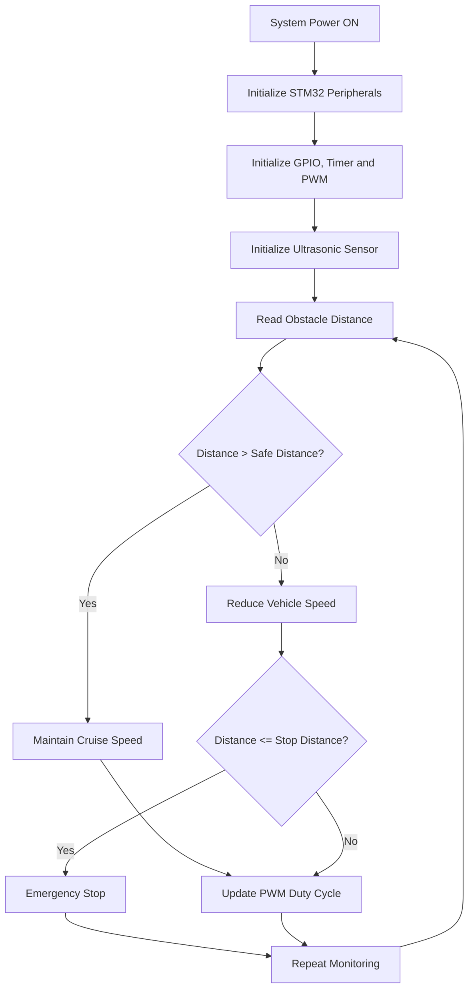
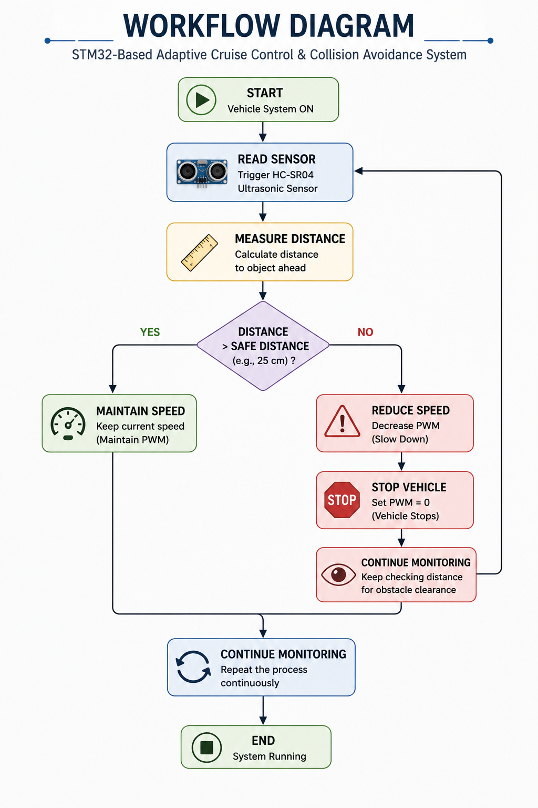
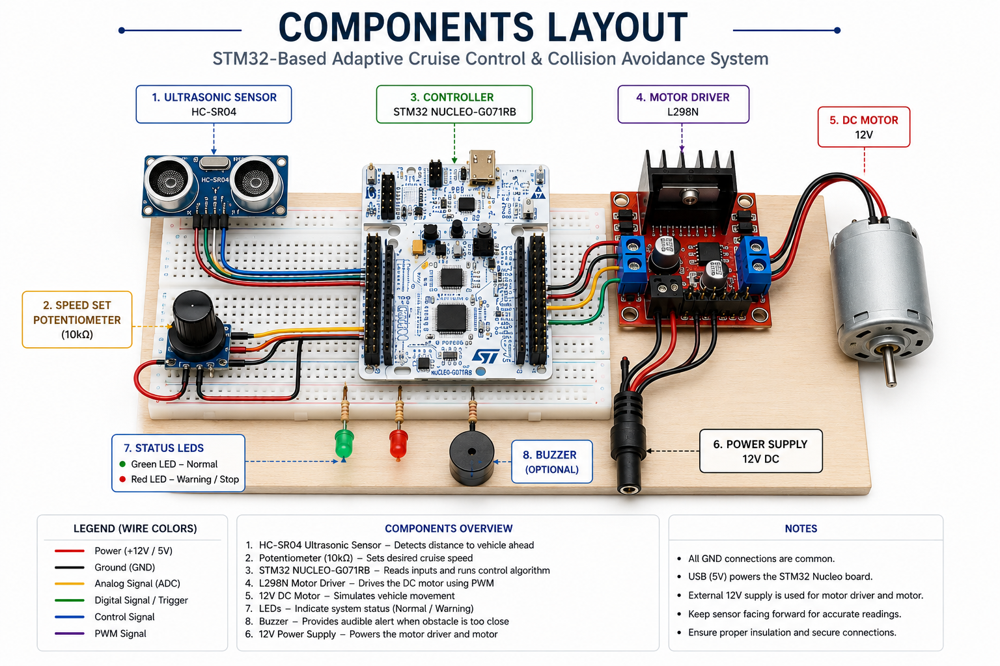
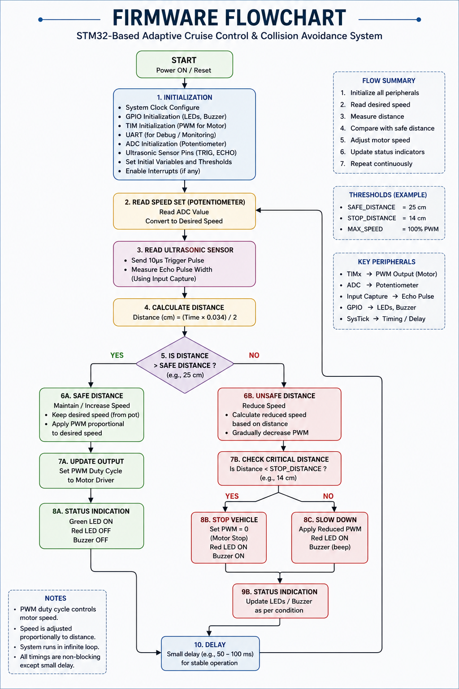
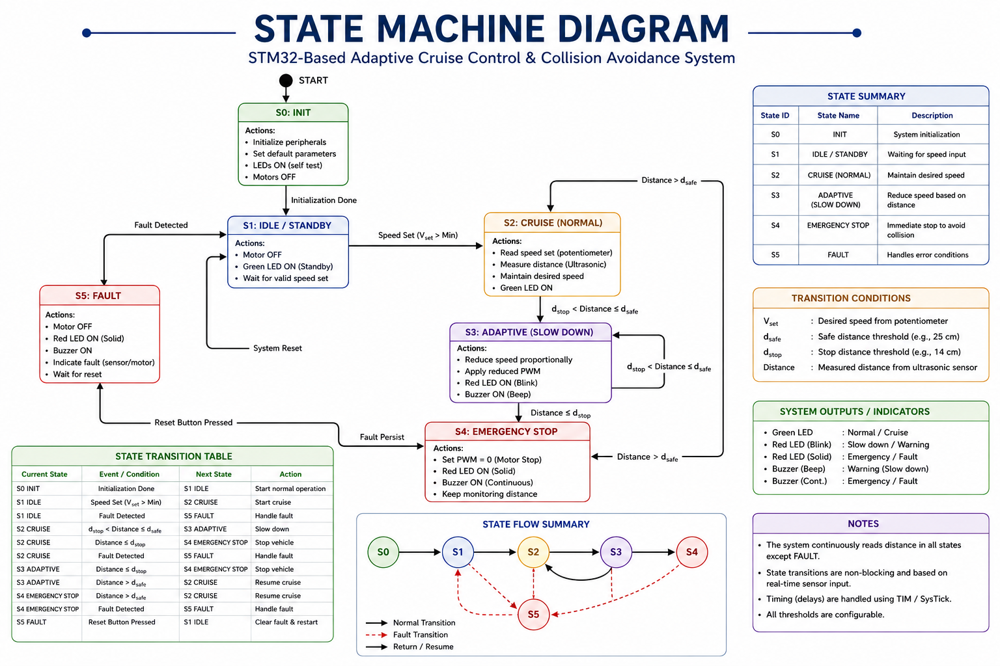
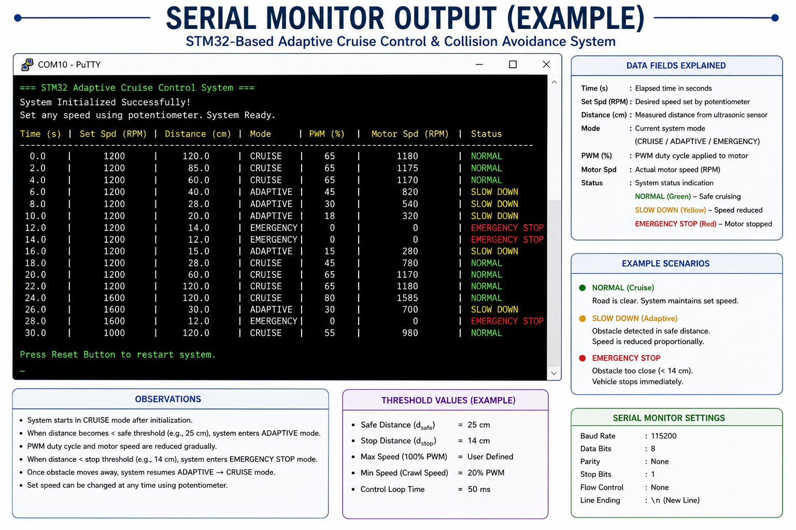
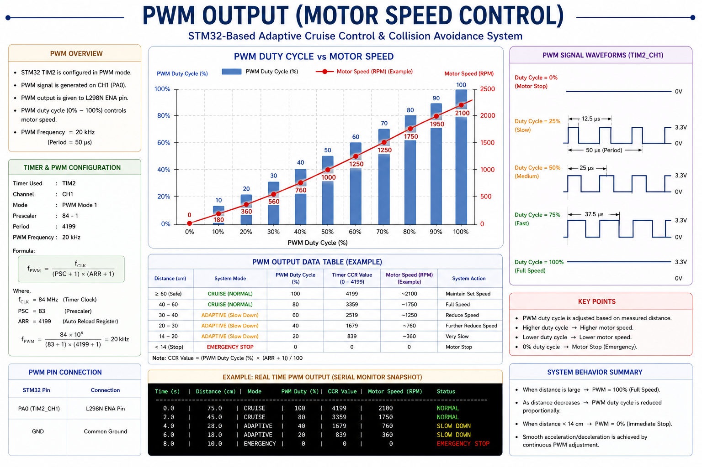
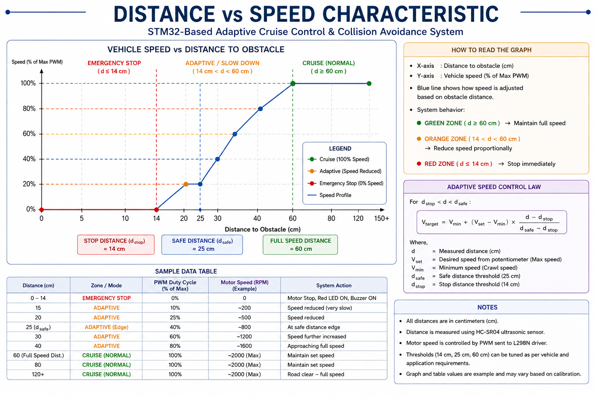
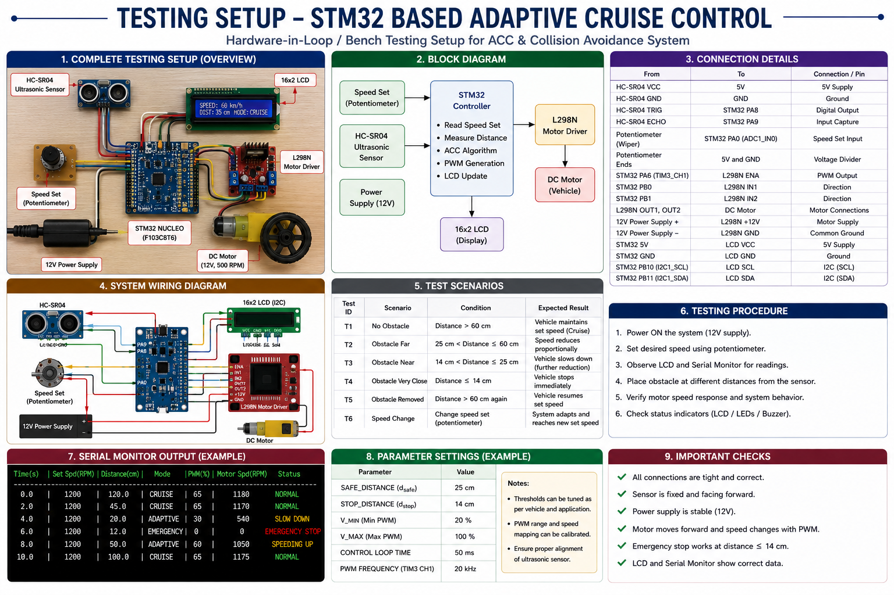

<p align="center">
  
</p>

# STM32-Based Adaptive Cruise Control and Collision Avoidance System


> **Embedded Systems | Automotive Electronics | Driver Assistance System | Adaptive Cruise Control | Collision Avoidance | STM32 HAL**

---

# Table of Contents

- [Overview](#overview)
- [Project Objectives](#project-objectives)
- [Key Features](#key-features)
- [Hardware Used](#hardware-used)
- [Software Used](#software-used)
- [System Specifications](#system-specifications)
- [Project Highlights](#project-highlights)

---

# Overview

Adaptive Cruise Control (ACC) is an Advanced Driver Assistance System (ADAS) that automatically adjusts vehicle speed based on the distance to the vehicle or obstacle ahead.

This project demonstrates the implementation of a simplified Adaptive Cruise Control and Collision Avoidance System using the **STM32 NUCLEO-G071RB** development board.

An HC-SR04 ultrasonic sensor continuously measures the distance to an obstacle. Based on the measured distance, the STM32 microcontroller dynamically adjusts the PWM duty cycle controlling the DC motor through an L298N motor driver.

When the obstacle moves closer, the vehicle speed is gradually reduced. If the obstacle reaches the minimum safe distance, the system immediately stops the motor to avoid collision.

The project demonstrates core embedded systems concepts including:

- Embedded C Programming
- STM32 HAL Drivers
- GPIO Configuration
- Timer Programming
- PWM Generation
- Motor Speed Control
- Sensor Interfacing
- Real-Time Decision Making
- Automotive Embedded Systems

---

# Project Objectives

The main objectives of this project are:

- Develop a real-time Adaptive Cruise Control system
- Detect obstacles using an ultrasonic sensor
- Dynamically adjust motor speed using PWM
- Implement collision avoidance logic
- Demonstrate real-time embedded firmware development
- Understand automotive control algorithms
- Learn STM32 peripheral programming
- Build a modular embedded software architecture

---

# Key Features

- Adaptive Cruise Control (ACC)
- Collision Avoidance System
- Real-Time Obstacle Detection
- PWM-Based Motor Speed Control
- Distance-Based Speed Adjustment
- Emergency Motor Stop
- Modular Embedded Firmware
- STM32 HAL Library Implementation
- Automotive-Oriented Software Design
- Reference Firmware Architecture
- Professional Project Documentation

---

# Hardware Used

| Component | Quantity | Purpose |
|------------|----------|----------------------------|
| STM32 NUCLEO-G071RB | 1 | Main Controller |
| HC-SR04 Ultrasonic Sensor | 1 | Distance Measurement |
| L298N Motor Driver | 1 | Motor Driver |
| 12V DC Motor | 1 | Vehicle Motion Simulation |
| Potentiometer | 1 | Desired Speed Adjustment |
| LEDs | 2 | Status Indication |
| Breadboard | 1 | Prototype Development |
| Jumper Wires | As Required | Connections |
| USB Cable | 1 | Programming & Power |

---

# Software Used

| Software | Purpose |
|-----------|----------------------------|
| STM32CubeIDE | Firmware Development |
| STM32CubeMX | Peripheral Configuration |
| STM32 HAL Library | Hardware Abstraction |
| Embedded C | Firmware Programming |
| Git | Version Control |
| GitHub | Project Hosting |
| PuTTY / Tera Term | UART Debugging |

---

# System Specifications

| Parameter | Value |
|------------|----------------|
| Controller | STM32G071RBT6 |
| Development Board | STM32 NUCLEO-G071RB |
| Programming Language | Embedded C |
| Framework | STM32 HAL |
| Sensor | HC-SR04 Ultrasonic |
| Motor Driver | L298N |
| Motor | 12V DC Motor |
| Speed Control | PWM |
| Distance Measurement | Ultrasonic Echo Timing |
| Application | Adaptive Cruise Control |

---

# Project Highlights

✔ Modular Firmware Design

✔ Real-Time Embedded Application

✔ Distance-Based Vehicle Speed Control

✔ Collision Avoidance Logic

✔ Automotive Embedded System

✔ PWM Motor Control

✔ Sensor Interfacing

✔ Professional GitHub Documentation

✔ Reference Implementation for Learning and Portfolio

---

# System Workflow



---

# System Block Diagram

<p align="center">
    
</p>

The system consists of an STM32 NUCLEO-G071RB development board connected to an HC-SR04 ultrasonic sensor for obstacle detection and an L298N motor driver for PWM-based DC motor control. The STM32 continuously processes distance measurements and adjusts vehicle speed accordingly.

---

# System Architecture

<p align="center">
    
</p>

The software architecture is divided into multiple functional layers.

### Input Layer

- HC-SR04 Ultrasonic Sensor
- Speed Set Potentiometer

### Processing Layer

- STM32 HAL Drivers
- GPIO
- Timers
- PWM
- Adaptive Cruise Control Algorithm
- Collision Avoidance Logic

### Output Layer

- L298N Motor Driver
- DC Motor
- Status LEDs
- UART Debug Messages

---

# Project Workflow

<p align="center">
    
</p>

Project execution sequence:

1. Initialize all peripherals.
2. Measure obstacle distance.
3. Compare measured distance with predefined safety thresholds.
4. Calculate required motor speed.
5. Generate PWM signal.
6. Drive motor.
7. Continue monitoring.

---

# Experimental Hardware Setup

<p align="center">
    
</p>

Hardware used in this project includes:

- STM32 NUCLEO-G071RB
- HC-SR04 Ultrasonic Sensor
- L298N Motor Driver
- 12V DC Motor
- Breadboard
- Potentiometer
- LEDs
- USB Programming Interface

---

# Wiring Diagram

<p align="center">
    
</p>

The STM32 interfaces with the HC-SR04 ultrasonic sensor for distance measurement and controls the DC motor through the L298N motor driver using PWM signals.

---

# Hardware Layout

<p align="center">
    
</p>

The components are arranged to allow easy prototyping and debugging while maintaining clear separation between sensing, control, and actuation modules.

---

# Firmware Flowchart

<p align="center">
    
</p>

The firmware continuously executes a control loop that:

- Reads sensor values
- Processes distance information
- Executes Adaptive Cruise Control logic
- Updates PWM output
- Controls motor speed

---

# Adaptive Cruise Control Algorithm

<p align="center">
    
</p>

The Adaptive Cruise Control algorithm dynamically adjusts vehicle speed according to obstacle distance.

| Distance | System Action |
|----------|---------------|
| > 60 cm | Maintain Cruise Speed |
| 30–60 cm | Reduce Speed Gradually |
| 15–30 cm | Slow Vehicle |
| ≤ 15 cm | Emergency Stop |

---

# State Machine

<p align="center">
    
</p>

The firmware operates through multiple states:

- Initialization
- Idle
- Cruise Mode
- Adaptive Cruise Mode
- Warning
- Emergency Stop
- Recovery

Each transition is triggered based on real-time obstacle distance measurements.

---

# Repository Structure

```text
STM32-Adaptive-Cruise-Control
│
├── docs/
├── firmware/
├── hardware/
├── images/
│   ├── architecture/
│   ├── hardware/
│   ├── flowcharts/
│   └── results/
├── simulations/
│
├── README.md
├── LICENSE
├── .gitignore
├── requirements.txt
└── CITATION.cff
```

---

## Directory Description

| Folder | Description |
|---------|-------------|
| docs | Technical documentation |
| firmware | STM32 firmware source code |
| hardware | Hardware documentation |
| images | Diagrams and project images |
| simulations | Simulation resources |

---

# Firmware Architecture

The firmware is developed using a modular architecture to improve readability, maintainability, and scalability.

## Firmware Modules

| Module | Description |
|---------|-------------|
| main | Main application loop |
| gpio | GPIO initialization |
| timer | Timer configuration |
| pwm | PWM generation |
| ultrasonic | HC-SR04 interface |
| motor | L298N motor driver |
| acc | Adaptive Cruise Control algorithm |
| system_config | System configuration parameters |

---

# Pin Connections

## HC-SR04 Ultrasonic Sensor

| HC-SR04 Pin | STM32 Pin |
|--------------|-----------|
| VCC | 5V |
| GND | GND |
| Trigger | PA0 |
| Echo | PA1 |

---

## L298N Motor Driver

| L298N Pin | STM32 Pin |
|------------|-----------|
| ENA | PA8 (PWM) |
| IN1 | PB0 |
| IN2 | PB1 |

---

## Potentiometer

| Pin | STM32 |
|------|--------|
| Output | PA4 (ADC) |
| VCC | 3.3V |
| GND | GND |

---

## LEDs

| LED | STM32 |
|------|--------|
| Green LED | PA5 |
| Red LED | PB5 |

---

# Installation

## Clone Repository

```bash
git clone https://github.com/shashikiranam/STM32-Adaptive-Cruise-Control.git
```

---

## Open Project

Open the project using

- STM32CubeIDE

---

## Configure Hardware

Connect:

- STM32 NUCLEO-G071RB
- HC-SR04
- L298N
- DC Motor
- Potentiometer

according to the hardware documentation.

---

## Build Project

Compile using

```text
Project → Build Project
```

---

## Flash Firmware

Flash using

```text
Run → Debug
```

or

STM32CubeProgrammer.

---

# Project Execution

The firmware performs the following sequence:

1. Initialize STM32 peripherals
2. Configure GPIO
3. Configure Timers
4. Configure PWM
5. Initialize Ultrasonic Sensor
6. Read obstacle distance
7. Execute Adaptive Cruise Control
8. Update PWM duty cycle
9. Drive DC Motor
10. Repeat continuously

---

# UART Debug Output

During execution, the UART terminal displays real-time system information.

<p align="center">

</p>

Typical UART information includes:

- Distance (cm)
- PWM Duty Cycle
- Motor Speed
- ACC State
- Collision Warning

---

# PWM Output

<p align="center">

</p>

The PWM duty cycle is dynamically adjusted according to obstacle distance.

Higher duty cycle:

- Higher motor speed

Lower duty cycle:

- Reduced motor speed

0% duty cycle:

- Emergency stop

---

# Distance vs Vehicle Speed

<p align="center">

</p>

The Adaptive Cruise Control algorithm modifies vehicle speed according to obstacle distance.

| Distance | Vehicle Behaviour |
|-----------|------------------|
| > 60 cm | Maintain Cruise Speed |
| 40–60 cm | Reduce Speed |
| 20–40 cm | Slow Vehicle |
| ≤ 15 cm | Stop Vehicle |

---

# Testing Setup

<p align="center">

</p>

The system was evaluated using the following hardware configuration:

- STM32 NUCLEO-G071RB
- HC-SR04 Ultrasonic Sensor
- L298N Motor Driver
- DC Motor
- Potentiometer
- USB Power Supply

---

# Test Scenarios

The following scenarios were evaluated.

## Scenario 1

No obstacle detected

Expected Result

- Vehicle maintains desired speed.

---

## Scenario 2

Obstacle detected far away

Expected Result

- Cruise speed maintained.

---

## Scenario 3

Obstacle approaching

Expected Result

- PWM duty cycle gradually decreases.

---

## Scenario 4

Obstacle very close

Expected Result

- Motor stops immediately.

---

# Performance Summary

| Feature | Status |
|----------|---------|
| Distance Measurement | ✓ |
| PWM Control | ✓ |
| Motor Control | ✓ |
| Collision Detection | ✓ |
| Adaptive Cruise Control | ✓ |
| Emergency Stop | ✓ |
| UART Debugging | ✓ |

---

# Future Enhancements

Potential improvements include:

- CAN Bus Communication
- Radar Sensor Integration
- Camera-Based Object Detection
- PID Speed Controller
- Adaptive Speed Learning
- Bluetooth Monitoring
- Embedded Linux Gateway
- Vehicle-to-Vehicle Communication (V2V)
- Vehicle-to-Infrastructure Communication (V2I)

---
# Contributing

Contributions are welcome.

If you would like to improve this project:

1. Fork the repository
2. Create a new feature branch
3. Commit your changes
4. Push the branch
5. Open a Pull Request

Please ensure that your code follows good embedded software development practices.

---

# Project Roadmap

Future development milestones include:

- [ ] CAN Communication
- [ ] FreeRTOS Integration
- [ ] PID-Based Speed Controller
- [ ] Multiple Ultrasonic Sensors
- [ ] Radar Sensor Integration
- [ ] Camera-Based Object Detection
- [ ] Bluetooth Monitoring
- [ ] Wi-Fi Monitoring
- [ ] Mobile Application
- [ ] Embedded Linux Gateway
- [ ] Automotive CAN Dashboard
- [ ] OTA Firmware Updates

---

# License

This project is licensed under the MIT License.

See the **LICENSE** file for more information.

---

# Citation

If you use this repository for educational or research purposes, please cite:

```text
Shashi Kiran A M

STM32-Based Adaptive Cruise Control and Collision Avoidance System

GitHub Repository:
https://github.com/shashikiranam/STM32-Adaptive-Cruise-Control
```

---

# References

- STM32G071RB Reference Manual
- STM32 HAL Driver Documentation
- STM32CubeIDE Documentation
- STM32CubeMX Documentation
- HC-SR04 Ultrasonic Sensor Datasheet
- L298N Motor Driver Datasheet
- ARM Cortex-M0+ Technical Reference Manual

---

# Acknowledgements

Special thanks to:

- STMicroelectronics
- STM32 Community
- Open Source Embedded Systems Community
- Technologics Training Center
- Embedded Systems Developers Community

---

# Repository Highlights

✔ Professional Project Documentation

✔ Modular Firmware Architecture

✔ Automotive Embedded System

✔ Adaptive Cruise Control

✔ Collision Avoidance

✔ STM32 HAL Firmware

✔ Hardware Documentation

✔ System Architecture

✔ Firmware Flowcharts

✔ Hardware Setup

✔ Wiring Diagrams

✔ Testing Documentation

✔ Learning-Oriented Reference Implementation

---

# Project Gallery

## Hardware

<p align="center">


</p>

---

## Architecture

<p align="center">


</p>

---

## Workflow

<p align="center">


</p>

---

## Results

<p align="center">


</p>

---

# Repository Statistics

| Category | Details |
|-----------|----------|
| Controller | STM32G071RBT6 |
| Development Board | STM32 NUCLEO-G071RB |
| Programming Language | Embedded C |
| Framework | STM32 HAL |
| IDE | STM32CubeIDE |
| Configuration Tool | STM32CubeMX |
| Sensor | HC-SR04 |
| Motor Driver | L298N |
| Actuator | 12V DC Motor |
| Application | Adaptive Cruise Control |
| Domain | Automotive Embedded Systems |

---

# About the Author

## Shashi Kiran A M

Embedded Systems Engineer | Automotive Electronics Engineer

### Areas of Interest

- Embedded Systems
- Automotive Electronics
- Embedded Linux
- Device Drivers
- STM32 Development
- NXP i.MX Processors
- CAN Communication
- AUTOSAR
- IoT Systems
- Machine Learning for Automotive Applications

GitHub

https://github.com/shashikiranam

LinkedIn

(Add your LinkedIn profile here)

Email

(Add your professional email here)

---

<p align="center">

⭐ If you found this project useful, please consider giving it a Star.

</p>

<p align="center">

Made with ❤️ by Shashi Kiran A M

</p>
