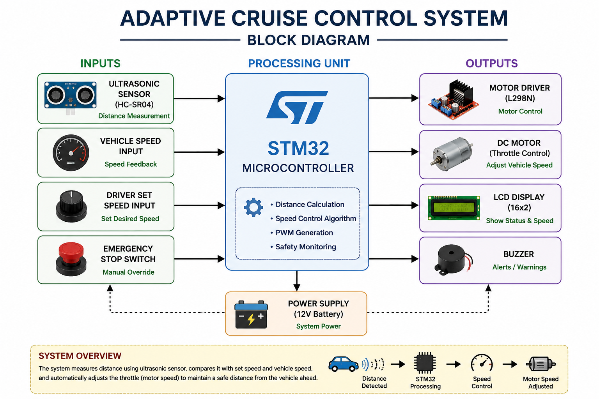

## Block Diagram

# STM32 Adaptive Cruise Control System

## Overview
This project implements an Adaptive Cruise Control (ACC) system using an STM32 microcontroller, ultrasonic sensor, and PWM-based motor control.

The system automatically adjusts vehicle speed based on obstacle distance and performs emergency stopping when objects are detected at close range.

---

## Features
- Real-time obstacle detection
- Distance-based speed control
- PWM motor speed regulation
- Emergency braking mechanism
- LCD status display
- Adaptive speed adjustment

---

## Technologies Used
- STM32 Microcontroller
- Embedded C
- Ultrasonic Sensor
- PWM
- LCD Display

---

## Working Principle
1. Ultrasonic sensor continuously measures obstacle distance.
2. STM32 processes distance data in real time.
3. PWM duty cycle is adjusted dynamically based on distance.
4. Motor speed reduces as obstacle distance decreases.
5. Emergency stop activates for very close obstacles.

---

## Applications
- Automotive safety systems
- Smart vehicle control
- Obstacle avoidance systems
- Intelligent transportation systems

---

## Future Improvements
- CAN communication support
- AI-based obstacle prediction
- Camera integration
- Embedded Linux integration

---

## Author
Shashi Kiran A M
