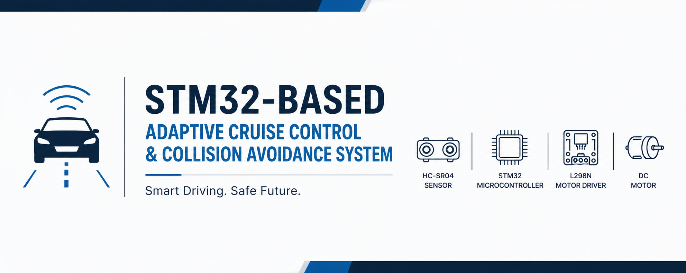
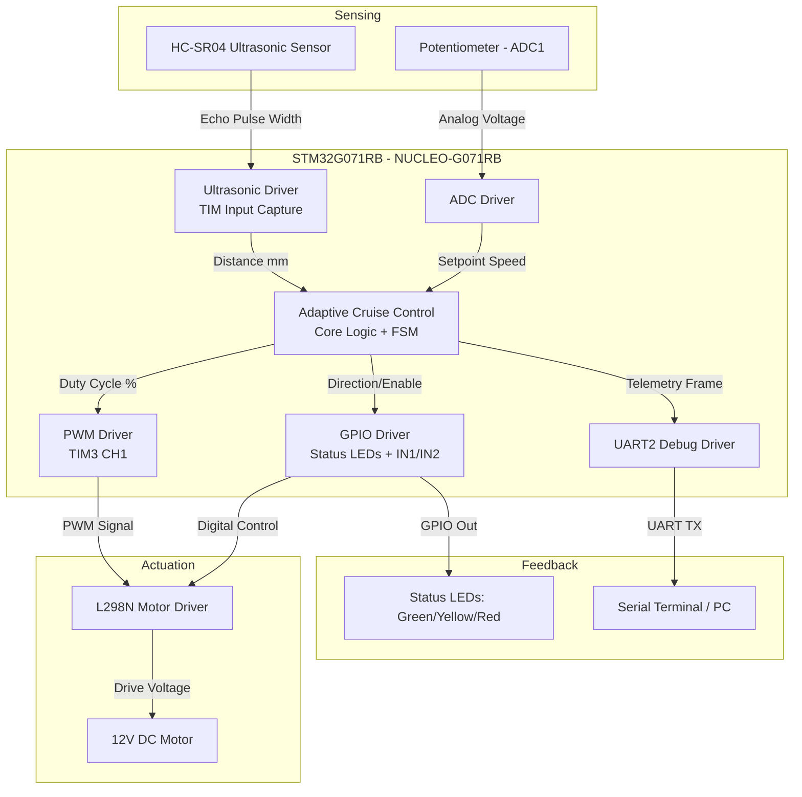
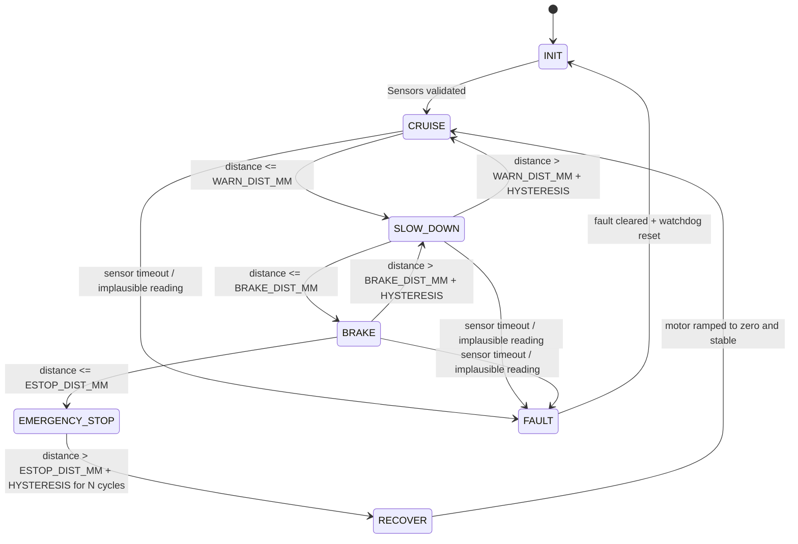
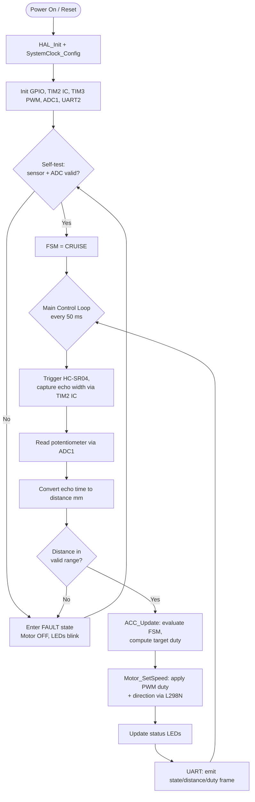

# STM32-Based Adaptive Cruise Control and Collision Avoidance System



<p align="center">
  
  
  
  
  
  
  
</p>

<p align="center">
  A modular, HAL-based embedded reference implementation of an Adaptive Cruise Control (ACC)
  and Collision Avoidance system built on the STM32 NUCLEO-G071RB, using ultrasonic distance
  sensing, closed-loop PWM motor speed control, and a deterministic safety-first state machine.
</p>

---

## Table of Contents

- [Overview](#overview)
- [Features](#features)
- [System Architecture](#system-architecture)
- [Hardware](#hardware)
- [Software](#software)
- [Control Algorithm](#control-algorithm)
- [Workflow](#workflow)
- [Wiring Diagram](#wiring-diagram)
- [Repository Structure](#repository-structure)
- [Getting Started](#getting-started)
- [Results](#results)
- [Testing](#testing)
- [Future Work](#future-work)
- [Documentation Index](#documentation-index)
- [License](#license)
- [Citation](#citation)

---

## Overview

This project implements a scaled-down, educationally-oriented **Adaptive Cruise Control (ACC)
and Collision Avoidance System** using an **STM32G071RB** microcontroller. The system
continuously measures the distance to a leading obstacle/vehicle using an **HC-SR04 ultrasonic
sensor**, and dynamically regulates the speed of a **12V DC motor** (driven through an **L298N**
H-bridge) via closed-loop PWM control to maintain a safe following distance.

The firmware is architected the way production automotive embedded software is structured:
strict separation of hardware abstraction (drivers), a deterministic finite state machine (FSM)
for control logic, layered safety interlocks, and a dedicated UART debug/telemetry channel —
all written against the STM32 HAL in idiomatic, portable Embedded C.

This repository is intended as a **portfolio-grade / learning reference implementation**. It is
not a certified automotive safety product (see [Disclaimer](#disclaimer-and-scope)).

## Features

- 🚗 **Adaptive speed regulation** — PWM duty cycle scales proportionally to measured distance error
- 🛑 **Multi-tier collision avoidance** — Warning, Braking, and Emergency Stop zones with hysteresis
- 🔁 **Deterministic Finite State Machine** — `INIT → CRUISE → SLOW_DOWN → BRAKE → EMERGENCY_STOP → RECOVER`
- 📏 **Ultrasonic ranging driver** — Timer input-capture based echo measurement, no busy-wait polling
- ⚙️ **Modular HAL-based drivers** — Ultrasonic, PWM, Motor, GPIO, Timer cleanly decoupled from application logic
- 🎚️ **Potentiometer-based cruise speed setpoint** via ADC
- 💡 **Status LEDs** — Green (Cruise), Yellow (Caution/Slow-down), Red (Brake/Emergency)
- 🖥️ **UART debug telemetry** — Real-time distance, speed, PWM duty, and FSM state streaming at 115200 baud
- 🧯 **Layered safety logic** — Sensor timeout detection, plausibility checks, fail-safe motor cutoff
- 📐 **Fully documented architecture** — Mermaid block diagrams, flowcharts, and wiring diagrams
- 🧩 **Portable HAL-only code** — No board-specific magic numbers buried in logic; all pin/timing config centralized in `system_config.h`

## System Architecture



## Hardware

| Component | Purpose | Qty |
|---|---|---|
| NUCLEO-G071RB (STM32G071RBT6) | Main controller | 1 |
| HC-SR04 Ultrasonic Sensor | Obstacle distance measurement | 1 |
| L298N Dual H-Bridge Motor Driver | 12V DC motor drive | 1 |
| 12V DC Motor | Vehicle propulsion analog | 1 |
| 10kΩ Potentiometer | Manual cruise-speed setpoint | 1 |
| LEDs (Green/Yellow/Red) + 330Ω resistors | Status indication | 3 |
| 12V external power supply | Motor power rail | 1 |
| Breadboard + jumper wires | Prototyping | — |
| USB Micro-B cable | ST-LINK programming/debug/UART | 1 |

Full bill of materials, electrical characteristics, and wiring pinout: see
[`hardware/COMPONENTS.md`](hardware/COMPONENTS.md),
[`hardware/PIN_CONNECTIONS.md`](hardware/PIN_CONNECTIONS.md), and
[`hardware/POWER_REQUIREMENTS.md`](hardware/POWER_REQUIREMENTS.md).

## Software

| Tool | Version (tested) |
|---|---|
| STM32CubeIDE | 1.15.x or later |
| STM32CubeMX | 6.11.x or later |
| STM32 HAL Driver Package | STM32G0xx HAL v1.5.x |
| GNU Arm Embedded Toolchain | bundled with CubeIDE |
| ST-LINK/V2-1 (onboard NUCLEO) | firmware ≥ V2J45 |

The firmware is 100% STM32 HAL — no LL-only calls, no vendor lock beyond the STM32G0 HAL layer —
so it is straightforward to retarget to other STM32G0/F0/F4 parts with pin remapping in
`system_config.h` and CubeMX regeneration.

## Control Algorithm

The ACC/Collision-Avoidance controller is implemented as a **deterministic finite state machine**
evaluated once per control cycle (default: 50 ms, configurable in `system_config.h`).



**Distance zones (defaults, tunable in `system_config.h`):**

| Zone | Distance | Behavior |
|---|---|---|
| Cruise | > 40 cm | Motor speed follows potentiometer setpoint |
| Slow-Down (Warning) | 25 cm – 40 cm | Yellow LED on; PWM duty scaled down proportionally to distance error |
| Brake | 12 cm – 25 cm | Red LED blinks; PWM duty reduced aggressively toward a low crawl speed |
| Emergency Stop | < 12 cm | Red LED solid; motor forced to 0% duty and held (H-bridge coast/brake) |
| Fault | sensor timeout / out-of-range echo | Motor forced OFF; all LEDs blink; UART fault frame emitted |

**Adaptive speed law (Slow-Down zone):**

```
duty(t) = duty_cruise * clamp( (distance_mm - BRAKE_DIST_MM) /
                                 (WARN_DIST_MM  - BRAKE_DIST_MM), 0.0, 1.0 )
```

This is a proportional controller on the distance error, clamped to `[0, duty_cruise]`, which
produces smooth deceleration as the lead obstacle gets closer and smooth re-acceleration as it
retreats (subject to hysteresis to avoid state chatter). Full derivation and tuning discussion
in [`docs/ALGORITHM.md`](docs/ALGORITHM.md).

## Workflow



## Wiring Diagram

```mermaid
flowchart LR
    subgraph NUCLEO["NUCLEO-G071RB"]
        PA0["PA0 (TIM2_CH1 - Echo IC)"]
        PA1["PA1 (GPIO Out - Trigger)"]
        PA6["PA6 (TIM3_CH1 - PWM Out)"]
        PB0["PB0 (GPIO Out - IN1)"]
        PB1["PB1 (GPIO Out - IN2)"]
        PA2["PA2 (USART2_TX)"]
        PA3["PA3 (USART2_RX)"]
        PA4["PA4 (ADC1_IN4)"]
        PB3["PB3 (GPIO Out - LED Green)"]
        PB4["PB4 (GPIO Out - LED Yellow)"]
        PB5["PB5 (GPIO Out - LED Red)"]
        GND1[GND]
        V5[5V]
    end

    subgraph HCSR04["HC-SR04"]
        Echo[Echo]
        Trig[Trig]
        VccU[VCC 5V]
        GndU[GND]
    end

    subgraph L298N["L298N Driver"]
        IN1[IN1]
        IN2[IN2]
        ENA[ENA - PWM]
        OUT1[OUT1]
        OUT2[OUT2]
        GndL[GND]
        V12[12V IN]
        V5out[5V OUT - unused]
    end

    subgraph Motor["12V DC Motor"]
        M1[Terminal 1]
        M2[Terminal 2]
    end

    subgraph Pot["Potentiometer"]
        Wiper[Wiper]
        PotV[VCC 3.3V]
        PotG[GND]
    end

    PA0 --- Echo
    PA1 --- Trig
    V5 --- VccU
    GND1 --- GndU

    PA6 --- ENA
    PB0 --- IN1
    PB1 --- IN2
    OUT1 --- M1
    OUT2 --- M2
    GND1 --- GndL
    V12 -.12V External Supply.- L298N

    PA4 --- Wiper
    PotV -. 3.3V .- Pot
    PotG --- GND1

    PA2 -. UART TX to USB-Serial/PC .- PA2
```

Full pin table with alternate function numbers: [`hardware/PIN_CONNECTIONS.md`](hardware/PIN_CONNECTIONS.md).

## Repository Structure

```
STM32-Adaptive-Cruise-Control/
├── README.md                  ← You are here
├── LICENSE
├── .gitignore
├── CITATION.cff
├── requirements.txt
├── docs/                      ← Full written documentation
├── firmware/                  ← STM32CubeIDE project, HAL drivers, application code
├── hardware/                  ← BOM, pinout, power budget
├── images/                    ← Diagrams and image-generation prompts
└── simulations/                ← Simulation/emulation notes (Renode/QEMU/Proteus)
```

## Getting Started

### 1. Clone and open in STM32CubeIDE

```bash
git clone https://github.com/<your-username>/STM32-Adaptive-Cruise-Control.git
cd STM32-Adaptive-Cruise-Control/firmware
```

Open **STM32CubeIDE** → `File → Open Projects from File System...` → select `firmware/`.

### 2. Regenerate HAL drivers (optional but recommended)

Open `STM32CubeMX/Project.ioc` in CubeMX, verify pin assignments against
[`hardware/PIN_CONNECTIONS.md`](hardware/PIN_CONNECTIONS.md), and click **Generate Code**. This
populates `firmware/Drivers/` with the STM32G0xx HAL/CMSIS sources (not tracked in this repo per
`.gitignore` — see [`firmware/Drivers/README.md`](firmware/Drivers/README.md)).

### 3. Build and flash

In CubeIDE: `Project → Build Project`, then `Run → Debug` (or `Run → Run`) with the NUCLEO board
connected via USB. The onboard ST-LINK handles flashing and provides a virtual COM port for UART
debug output.

### 4. Open a serial terminal

- Baud: `115200`, 8N1, no flow control
- You should see telemetry frames such as:
  ```
  [ACC] state=CRUISE dist=87cm setpoint=65% duty=65% dir=FWD
  [ACC] state=SLOW_DOWN dist=34cm setpoint=65% duty=41% dir=FWD
  [ACC] state=BRAKE dist=18cm setpoint=65% duty=12% dir=FWD
  [ACC] state=EMERGENCY_STOP dist=09cm setpoint=65% duty=00% dir=STOP
  ```

## Results

> **Note:** This repository ships as a reference implementation. The plots and photos below are
> described as **image generation prompts** (see [`images/results/README.md`](images/results/README.md))
> rather than fabricated data, since no physical test bench data is bundled with this repo. When you
> build the hardware, replace these prompts with your own captured logs/photos.

Expected qualitative behavior once built:

- Smooth monotonic PWM duty reduction as an obstacle approaches through the Slow-Down zone
- Sub-100ms reaction latency from Brake-zone entry to reduced motor duty (bounded by the 50ms
  control loop period plus HC-SR04 echo time, typically < 25 ms round trip at close range)
- Zero motor duty within one control cycle of crossing the Emergency-Stop threshold
- No FSM chatter at zone boundaries, due to the hysteresis band on all transitions

## Testing

See [`docs/TESTING.md`](docs/TESTING.md) for the full test plan, including unit-level driver
tests, HIL bench procedures, boundary/hysteresis tests, and fault-injection tests (sensor
disconnect, out-of-range echo, ADC rail conditions).

## Future Work

- [ ] Replace single ultrasonic sensor with sensor fusion (ultrasonic + IR) for redundancy
- [ ] Add CAN-FD telemetry output for integration with a vehicle bus simulator
- [ ] Closed-loop speed feedback via motor encoder (currently open-loop PWM → DC motor)
- [ ] PID controller upgrade from the current proportional-only speed law
- [ ] Low-power STOP mode entry during prolonged Cruise state with no obstacle
- [ ] Port to STM32G0 dual-core / STM32H5 for hard real-time scheduling via RTOS (FreeRTOS)
- [ ] Add a companion PC dashboard (Python/Qt) for live plotting of UART telemetry
- [ ] Formal MISRA-C static analysis pass

## Documentation Index

| Document | Contents |
|---|---|
| [`docs/PROJECT_OVERVIEW.md`](docs/PROJECT_OVERVIEW.md) | Goals, scope, requirements traceability |
| [`docs/HARDWARE.md`](docs/HARDWARE.md) | Detailed hardware design and rationale |
| [`docs/SOFTWARE.md`](docs/SOFTWARE.md) | Firmware architecture, module responsibilities |
| [`docs/ALGORITHM.md`](docs/ALGORITHM.md) | Control theory, FSM design, tuning |
| [`docs/TESTING.md`](docs/TESTING.md) | Test plan and verification matrix |

## Disclaimer and Scope

This is an **educational / portfolio reference implementation**, not a production or
safety-certified automotive system. It does not implement ISO 26262 functional safety processes,
is not qualified against automotive EMC/environmental standards, and must not be used to control
a real vehicle or any system where failure could cause injury. It is designed to teach the
architectural patterns (HAL abstraction, FSM control, layered safety interlocks) used in real
ADAS systems, at a hobbyist/benchtop scale.

## License

Released under the [MIT License](LICENSE).

## Citation

If you use this repository in academic or educational work, please cite it using the metadata in
[`CITATION.cff`](CITATION.cff).
