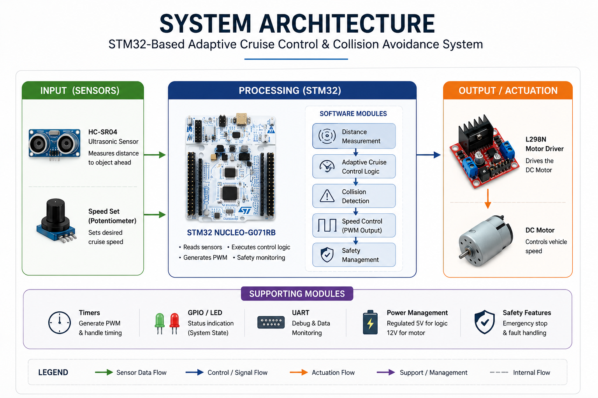
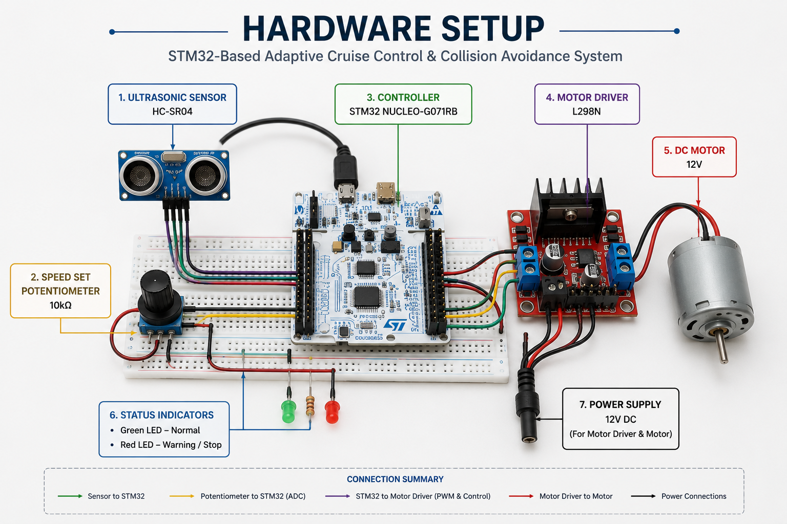
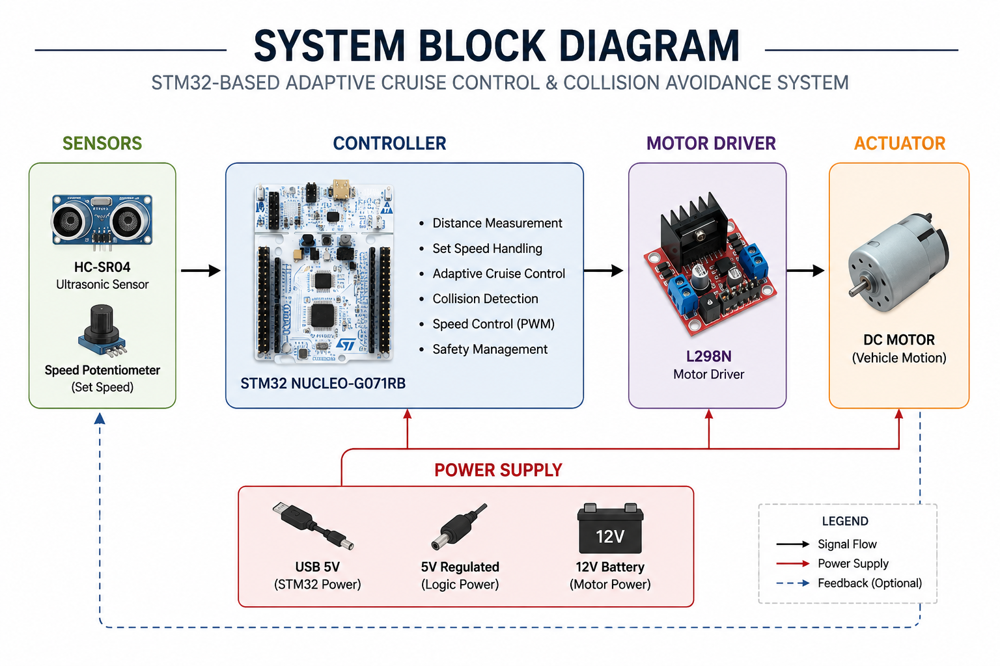
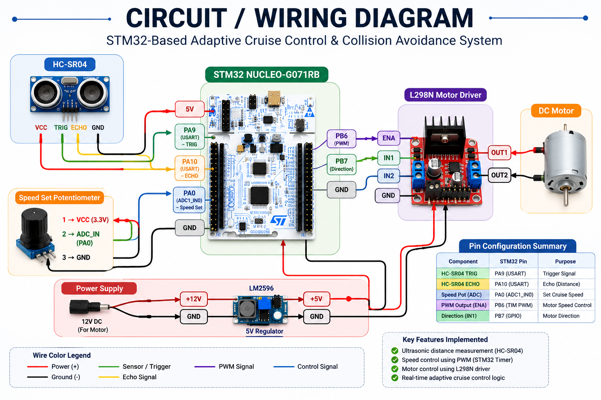
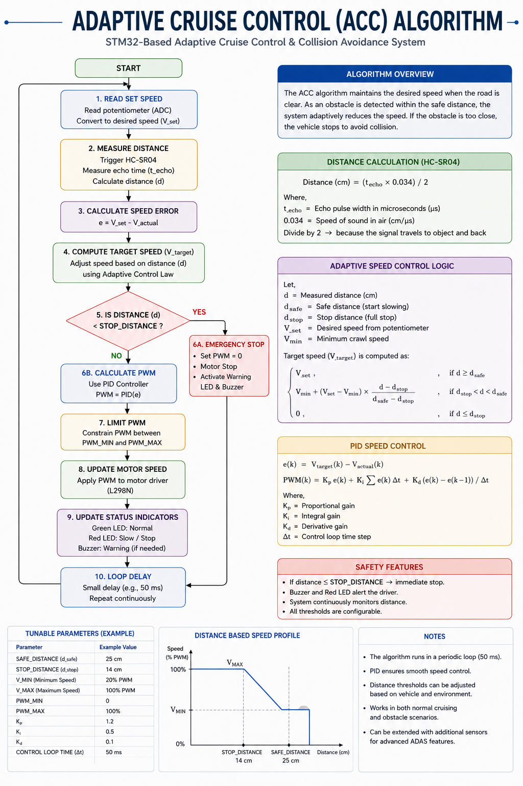

# STM32-Based Adaptive Cruise Control and Collision Avoidance System

<p align="center">
  
</p>

<p align="center">


</p>

---

# Overview

This project demonstrates a real-time **Adaptive Cruise Control (ACC)** and **Collision Avoidance System** developed using the **STM32 NUCLEO-G071RB** microcontroller.

The system continuously measures the distance to obstacles using an **HC-SR04 Ultrasonic Sensor**, processes the information using an Adaptive Cruise Control algorithm, and dynamically adjusts the speed of a **12V DC Motor** through PWM generated by the STM32 timer and an **L298N Motor Driver**.

The firmware follows a modular Embedded C architecture based on the STM32 HAL, making the project easy to understand, maintain, and extend.

This project was developed as an educational and portfolio demonstration of automotive embedded systems concepts including sensor interfacing, PWM motor control, finite state machines, collision avoidance logic, and real-time embedded firmware development.

---

# Table of Contents

- Overview
- Features
- Project Preview
- Hardware Components
- Software Stack
- System Architecture
- Hardware Setup
- Wiring Diagram
- Flowcharts
- Control Algorithm
- Firmware Architecture
- Results
- Testing
- Repository Structure
- Getting Started
- Future Improvements
- Documentation
- License
- Author

---

# Features

- Adaptive Cruise Control
- Collision Avoidance
- Real-Time Obstacle Detection
- STM32 HAL Based Firmware
- PWM Motor Speed Control
- HC-SR04 Sensor Interface
- ADC Cruise Speed Control
- Finite State Machine
- UART Debug Console
- Status LEDs
- Modular Embedded C Architecture
- Professional Documentation

---

# Project Preview

## System Architecture

<p align="center">

</p>

---

## Hardware Setup

<p align="center">

</p>

---

## Project Workflow

<p align="center">

</p>

---

## Runtime Results

<p align="center">

</p>

---

# Hardware Components

| Component | Description |
|-----------|-------------|
| STM32 NUCLEO-G071RB | Main Controller |
| HC-SR04 Ultrasonic Sensor | Distance Measurement |
| L298N Motor Driver | Motor Control |
| 12V DC Motor | Vehicle Motion Simulation |
| Potentiometer | Cruise Speed Adjustment |
| LEDs | Status Indication |
| Breadboard | Prototype Circuit |
| 12V Power Supply | Motor Supply |

---

# Software Stack

| Software | Purpose |
|-----------|---------|
| STM32CubeIDE | Firmware Development |
| STM32CubeMX | Peripheral Configuration |
| STM32 HAL | Hardware Abstraction |
| Embedded C | Programming Language |
| Git | Version Control |
| GitHub | Repository Hosting |
---

# System Architecture

<p align="center">
  
</p>

The Adaptive Cruise Control system is divided into four major functional blocks:

- Sensor Acquisition
- Embedded Processing
- Motor Control
- User Feedback

The STM32 continuously reads the ultrasonic sensor and cruise-speed potentiometer, processes the data through the Adaptive Cruise Control algorithm, generates PWM for the motor driver, and updates the system status through LEDs and UART telemetry.

---

# Block Diagram

<p align="center">
  
</p>

The block diagram illustrates the complete interaction between the sensing layer, processing layer, control layer, and feedback layer.

Signal flow:

```
HC-SR04
      │
      ▼
STM32 ADC + Timer
      │
      ▼
Adaptive Cruise Control Algorithm
      │
      ▼
PWM Generation
      │
      ▼
L298N Motor Driver
      │
      ▼
DC Motor
      │
      ▼
Vehicle Motion
```

---

# Firmware Workflow

<p align="center">
  
</p>

The firmware executes periodically and performs the following operations:

1. Initialize peripherals
2. Trigger the HC-SR04 ultrasonic sensor
3. Measure echo pulse width
4. Calculate obstacle distance
5. Read cruise-speed setpoint from ADC
6. Execute Adaptive Cruise Control logic
7. Generate PWM duty cycle
8. Control the motor through the L298N driver
9. Update LEDs
10. Send UART telemetry
11. Repeat continuously

---

# Hardware Setup

<p align="center">
  
</p>

## Hardware Used

| Component | Quantity |
|-----------|---------:|
| STM32 NUCLEO-G071RB | 1 |
| HC-SR04 Ultrasonic Sensor | 1 |
| L298N Motor Driver | 1 |
| 12V DC Motor | 1 |
| Potentiometer | 1 |
| LEDs | 3 |
| Breadboard | 1 |
| External Power Supply | 1 |

The STM32 acts as the central controller, acquiring sensor data, executing the Adaptive Cruise Control algorithm, and controlling the motor in real time.

---

# Wiring Diagram

<p align="center">
  
</p>

The wiring diagram shows all electrical connections between the STM32 development board and the external peripherals.

## Peripheral Connections

| Peripheral | Interface |
|------------|-----------|
| HC-SR04 | GPIO + Timer Input Capture |
| Potentiometer | ADC |
| L298N | PWM + GPIO |
| LEDs | GPIO |
| UART | USART2 |

---

# Board Connections

<p align="center">
  
</p>

### STM32 Pin Assignment

| STM32 Pin | Function |
|-----------|----------|
| PA0 | HC-SR04 Echo |
| PA1 | HC-SR04 Trigger |
| PA4 | Potentiometer (ADC) |
| PA6 | PWM Output |
| PB0 | Motor IN1 |
| PB1 | Motor IN2 |
| PA2 | UART TX |
| PA3 | UART RX |
| PB3 | Green LED |
| PB4 | Yellow LED |
| PB5 | Red LED |

The modular pin mapping allows the firmware to be easily ported to other STM32 microcontrollers with minimal changes.
---

# Control Algorithm

The Adaptive Cruise Control (ACC) algorithm continuously monitors the obstacle distance and dynamically adjusts the vehicle speed using PWM motor control.

The controller operates using a deterministic Finite State Machine (FSM) with predefined distance thresholds to ensure safe operation.

<p align="center">
  
</p>

---

## Operating States

| State | Description |
|--------|-------------|
| INIT | Initialize all peripherals and perform system checks |
| CRUISE | Vehicle travels at the selected cruise speed |
| SLOW_DOWN | Reduce motor speed when an obstacle enters the warning zone |
| BRAKE | Apply aggressive speed reduction in the braking zone |
| EMERGENCY_STOP | Immediately stop the motor to avoid collision |
| RECOVER | Resume cruise operation once the path is clear |
| FAULT | Enter safe state if sensor or hardware failure is detected |

---

## Distance Zones

| Distance | Action |
|-----------|--------|
| > 40 cm | Cruise Mode |
| 25–40 cm | Slow Down |
| 12–25 cm | Brake |
| < 12 cm | Emergency Stop |

---

## Adaptive Speed Control

The motor speed is continuously adjusted according to the measured obstacle distance.

- Large distance → High PWM duty cycle
- Medium distance → Reduced PWM
- Short distance → Low PWM
- Critical distance → Motor Stop

This provides smooth deceleration and acceleration while maintaining a safe following distance.

---

# Firmware Architecture

<p align="center">
  
</p>

The firmware is organized into independent modules to simplify maintenance, debugging, and future enhancements.

## Firmware Modules

| Module | Responsibility |
|---------|----------------|
| Main Application | Initializes peripherals and controls the execution loop |
| ACC Controller | Executes the Adaptive Cruise Control algorithm |
| Ultrasonic Driver | Measures obstacle distance |
| ADC Driver | Reads cruise speed setpoint |
| PWM Driver | Controls motor speed |
| Motor Driver | Drives the L298N H-Bridge |
| UART Driver | Sends debug information |
| LED Driver | Indicates system status |

---

## Firmware Execution Flow

```
Power ON
    │
    ▼
Initialize HAL
    │
    ▼
Initialize Peripherals
    │
    ▼
Read Sensor Data
    │
    ▼
Execute ACC Algorithm
    │
    ▼
Generate PWM
    │
    ▼
Drive Motor
    │
    ▼
Update LEDs
    │
    ▼
Send UART Data
    │
    ▼
Repeat
```

---

# Runtime Results

The following screenshots demonstrate the successful implementation of the Adaptive Cruise Control system.

---

## System Running

<p align="center">
  
</p>

The firmware continuously measures obstacle distance and updates the motor speed according to the Adaptive Cruise Control algorithm.

---

## UART Output

<p align="center">
  
</p>

Real-time UART telemetry displays:

- Measured Distance
- PWM Duty Cycle
- Cruise Speed
- FSM State
- Warning Status

---

## Motor Control

<p align="center">
  
</p>

The PWM output generated by the STM32 controls the L298N motor driver, providing smooth speed regulation.

---

## Obstacle Detection

<p align="center">
  
</p>

The HC-SR04 sensor continuously measures the distance to obstacles, allowing the controller to react in real time.

---

# Testing

The project was validated using both hardware testing and functional verification.

## Test Cases

| Test | Expected Result | Status |
|------|-----------------|--------|
| STM32 Boot | Successful Initialization | ✅ |
| Ultrasonic Sensor | Accurate Distance Measurement | ✅ |
| ADC Reading | Stable Cruise Speed Input | ✅ |
| PWM Generation | Variable Duty Cycle | ✅ |
| Motor Driver | Correct Forward Motion | ✅ |
| UART Communication | Continuous Debug Output | ✅ |
| Collision Avoidance | Emergency Stop Activated | ✅ |
| LED Indicators | Correct State Indication | ✅ |

---

## Validation Summary

The implemented system successfully demonstrates:

- Real-time obstacle detection
- Adaptive vehicle speed control
- Collision avoidance
- PWM motor control
- Modular Embedded C firmware
- Reliable STM32 HAL peripheral integration
- Stable real-time operation suitable for educational and portfolio purposes

---
# Repository Structure

```text
STM32-Adaptive-Cruise-Control
│
├── .github/
│   └── workflows/
│
├── docs/
│
├── firmware/
│   ├── Core/
│   ├── Drivers/
│   ├── Inc/
│   ├── Src/
│   └── stm32cubemx/
│
├── hardware/
│
├── images/
│   ├── architecture/
│   ├── flowcharts/
│   ├── hardware/
│   └── results/
│
├── simulations/
│
├── .gitignore
├── CHANGELOG.md
├── CODE_OF_CONDUCT.md
├── CONTRIBUTING.md
├── CITATION.cff
├── LICENSE
└── README.md
```

---

# Getting Started

## Prerequisites

Install the following software before building the project:

- STM32CubeIDE
- STM32CubeMX
- STM32 HAL Drivers
- ST-LINK USB Driver
- Git

---

## Clone Repository

```bash
git clone https://github.com/shashikiranam/STM32-Adaptive-Cruise-Control.git
```

Move into the project directory.

```bash
cd STM32-Adaptive-Cruise-Control
```

---

## Open in STM32CubeIDE

1. Open STM32CubeIDE.
2. Select **File → Open Projects from File System**.
3. Choose the `firmware` folder.
4. Build the project.
5. Connect the STM32 NUCLEO-G071RB.
6. Flash the firmware using the onboard ST-LINK programmer.

---

## Hardware Connections

Connect:

- HC-SR04 Ultrasonic Sensor
- L298N Motor Driver
- 12V DC Motor
- Potentiometer
- Status LEDs
- External Power Supply

according to the wiring diagram provided in the **Hardware** section.

---

# Project Workflow

<p align="center">
  
</p>

Execution sequence:

```
Power ON
      │
      ▼
STM32 Initialization
      │
      ▼
Peripheral Initialization
      │
      ▼
Read Sensor Values
      │
      ▼
Measure Distance
      │
      ▼
Execute ACC Algorithm
      │
      ▼
Generate PWM
      │
      ▼
Motor Speed Control
      │
      ▼
Update LEDs
      │
      ▼
UART Debug Output
      │
      ▼
Repeat
```

---

# Documentation

Additional documentation is available inside the **docs** directory.

| Document | Description |
|----------|-------------|
| PROJECT_OVERVIEW.md | Complete project overview |
| HARDWARE.md | Hardware design |
| SOFTWARE.md | Firmware architecture |
| ALGORITHM.md | Adaptive Cruise Control algorithm |
| TESTING.md | Testing and validation |

---

# Future Improvements

The project can be further enhanced by implementing:

- CAN Bus Communication
- CAN FD Support
- Vehicle-to-Vehicle Communication
- FreeRTOS Integration
- PID Speed Controller
- Wheel Encoder Feedback
- Camera-Based Obstacle Detection
- Sensor Fusion
- OBD-II Diagnostics
- AUTOSAR Architecture
- AI-Based Collision Prediction
- Ethernet Connectivity
- MQTT Cloud Dashboard
- Mobile Monitoring Application

---

# Skills Demonstrated

This project demonstrates practical experience in:

- Embedded C Programming
- STM32 HAL Development
- STM32CubeIDE
- STM32CubeMX
- GPIO Programming
- ADC Interfacing
- PWM Generation
- Timer Input Capture
- UART Communication
- Embedded Firmware Architecture
- Real-Time Embedded Systems
- Automotive Embedded Systems
- Sensor Interfacing
- Motor Control
- Technical Documentation
- Git & GitHub

---

# Author

## Shashi Kiran A M

M.Tech – Automotive Electronics

Embedded Systems Engineer

### Technical Skills

- Embedded C
- C
- STM32
- STM32CubeIDE
- STM32CubeMX
- UART
- ADC
- PWM
- Timers
- GPIO
- Embedded Systems
- Automotive Electronics
- Git
- GitHub

GitHub

https://github.com/shashikiranam

---

# License

This project is licensed under the MIT License.

See the LICENSE file for complete details.

---

# Citation

If you use this repository for academic or educational purposes, please cite it using the metadata provided in `CITATION.cff`.

---

# Acknowledgements

This project was developed as part of an Embedded Systems portfolio to demonstrate practical implementation of Adaptive Cruise Control and Collision Avoidance using the STM32 platform.

Special thanks to:

- STMicroelectronics
- STM32CubeIDE Development Team
- STM32 HAL Library
- Open Source Embedded Systems Community

---

<p align="center">

⭐ If you found this project useful, consider giving it a star on GitHub.

</p>
