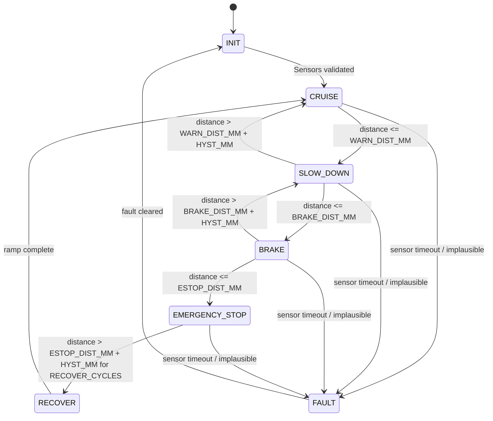

# Control Algorithm Documentation

## 1. Overview

The controller combines two elements:

1. A **finite state machine (FSM)** that determines which behavioral *mode* the system is in
   (Cruise, Slow-Down, Brake, Emergency-Stop, Fault, Init, Recover).
2. A **proportional control law** that, within the Slow-Down and Brake modes, computes a
   continuous target PWM duty cycle from the measured distance error.

This hybrid approach (discrete mode switching + continuous control within a mode) mirrors how
real ADAS longitudinal controllers are structured: a supervisory state machine handles mode
arbitration and safety interlocks, while a lower-level control law handles the smooth,
continuous actuation within each mode.

## 2. State Machine Definition



### 2.1 State Descriptions

| State | Entry condition | Motor behavior | LEDs |
|---|---|---|---|
| `INIT` | Power-on / reset | Motor forced off | All LEDs off, then a brief self-test blink |
| `CRUISE` | Self-test passed, distance > `WARN_DIST_MM` | Duty = potentiometer setpoint, direction = forward | Green solid |
| `SLOW_DOWN` | `BRAKE_DIST_MM < distance <= WARN_DIST_MM` | Duty = proportional law (see §3), direction = forward | Yellow solid |
| `BRAKE` | `ESTOP_DIST_MM < distance <= BRAKE_DIST_MM` | Duty = proportional law, clamped to a low crawl max, direction = forward | Red blinking (2 Hz) |
| `EMERGENCY_STOP` | `distance <= ESTOP_DIST_MM` | Duty = 0%, `IN1`/`IN2` set to active brake (both high) | Red solid |
| `RECOVER` | Distance stays above `ESTOP_DIST_MM + HYST_MM` for `RECOVER_CYCLES` consecutive cycles | Duty ramps from 0 back toward setpoint over a few cycles | Yellow → Green transition |
| `FAULT` | Ultrasonic timeout or implausible reading (< 20 mm or > 4500 mm) in any active state | Motor forced off | All LEDs blink together (4 Hz) |

### 2.2 Default Thresholds

Defined in `system_config.h`, all tunable:

| Constant | Default | Meaning |
|---|---|---|
| `ACC_WARN_DIST_MM` | 400 | Enter Slow-Down below this distance |
| `ACC_BRAKE_DIST_MM` | 250 | Enter Brake below this distance |
| `ACC_ESTOP_DIST_MM` | 120 | Enter Emergency-Stop below this distance |
| `ACC_HYSTERESIS_MM` | 30 | Added back on the "recovering" transition to prevent chatter |
| `ACC_RECOVER_CYCLES` | 10 | Consecutive clear cycles (≈500 ms at 50 ms/cycle) required to leave `EMERGENCY_STOP` |
| `ACC_BRAKE_MAX_DUTY_PCT` | 20 | Duty ceiling while in `BRAKE`, even if the proportional law would allow more |

## 3. Proportional Adaptive Speed Law

Within `SLOW_DOWN`, target duty is computed as:

```
error_ratio = (distance_mm - ACC_BRAKE_DIST_MM) / (ACC_WARN_DIST_MM - ACC_BRAKE_DIST_MM)
error_ratio = clamp(error_ratio, 0.0, 1.0)
target_duty = cruise_setpoint_duty * error_ratio
```

This yields:

- `target_duty = cruise_setpoint_duty` exactly at the Slow-Down entry boundary (`distance ==
  WARN_DIST_MM`) — a smooth handoff from `CRUISE`, with no step discontinuity.
- `target_duty → 0` as `distance → BRAKE_DIST_MM` — a smooth handoff into `BRAKE`.

Within `BRAKE`, the same formula is used but referenced against `BRAKE_DIST_MM`/`ESTOP_DIST_MM`
and the result is clamped to `ACC_BRAKE_MAX_DUTY_PCT`:

```
error_ratio = (distance_mm - ACC_ESTOP_DIST_MM) / (ACC_BRAKE_DIST_MM - ACC_ESTOP_DIST_MM)
error_ratio = clamp(error_ratio, 0.0, 1.0)
target_duty = min(cruise_setpoint_duty, ACC_BRAKE_MAX_DUTY_PCT) * error_ratio
```

This is a **proportional-only controller** on distance error (no integral/derivative term). It
was chosen deliberately for this reference implementation because:

- It is trivially stable (no risk of integral windup or derivative kick) for a first
  reference/teaching implementation.
- The system has no velocity feedback (open-loop PWM → DC motor), so a full PID would be tuned
  against an unmodeled, unmeasured plant response — a P-only law keeps the demonstrated behavior
  easy to reason about and verify.
- `docs/PROJECT_OVERVIEW.md` Future Work notes a PID upgrade path once encoder feedback is added.

## 4. Hysteresis and Anti-Chatter Design

Every "retreat" transition (e.g., `SLOW_DOWN → CRUISE`, `BRAKE → SLOW_DOWN`) requires the
distance to clear the boundary **plus** `ACC_HYSTERESIS_MM`, while every "approach" transition
uses the raw boundary. This asymmetric threshold band prevents the FSM from rapidly toggling
between two states when the measured distance sits near a boundary (which is common given HC-SR04
measurement noise of a few millimeters).

The `EMERGENCY_STOP → RECOVER` transition additionally requires `ACC_RECOVER_CYCLES` consecutive
clear readings (not just one), since resuming motion from a full stop is the highest-consequence
transition in the FSM and warrants the most conservative debounce.

## 5. Ultrasonic Timing Sequence

```mermaid
sequenceDiagram
    participant Loop as Main Loop (50ms tick)
    participant GPIO as Trigger GPIO (PA1)
    participant Sensor as HC-SR04
    participant TIM as TIM2 Input Capture (PA0)
    participant ISR as TIM2 IRQ Handler

    Loop->>GPIO: Set HIGH for 10us, then LOW
    GPIO->>Sensor: Trigger pulse
    Sensor->>Sensor: Emits 8x 40kHz burst
    Sensor->>TIM: Echo pin rises (reflection arms timing)
    TIM->>ISR: Capture event (rising edge), record t_start
    Sensor->>TIM: Echo pin falls (reflection received)
    TIM->>ISR: Capture event (falling edge), record t_end
    ISR->>ISR: pulse_width_us = t_end - t_start
    ISR->>Loop: Set new_reading_ready flag
    Loop->>Loop: distance_mm = pulse_width_us * 0.343 / 2
```

Speed of sound used: **343 m/s at ~20°C** (`0.343 mm/us` after the standard divide-by-2 for
round-trip). No temperature compensation is applied — see Limitations.

## 6. Fault Detection

A reading is rejected (→ `FAULT` state) if any of the following hold:

- No falling edge received within `US_ECHO_TIMEOUT_MS` (default 30 ms) of the trigger — sensor
  disconnected, miswired, or no echo returned (open air beyond max range).
- Computed distance `< US_MIN_VALID_MM` (20 mm) — implausible, likely an electrical glitch or
  cross-talk.
- Computed distance `> US_MAX_VALID_MM` (4500 mm) — beyond the HC-SR04's reliable range,
  reading likely invalid.

On fault, `Motor_EmergencyOff()` is called immediately (motor forced to 0% duty, brake mode on
the H-bridge), independent of the FSM's normal transition logic — this is a defense-in-depth
safety measure, not just a state transition, matching the "layered safety logic" requirement in
the project brief.

## 7. Tuning Methodology

1. Start with the default thresholds and confirm qualitative behavior (motor slows smoothly, does
   not chatter, stops before contact) using a hand-held obstacle at your bench.
2. Log UART telemetry (see `docs/TESTING.md`) while sweeping an obstacle at a controlled walking
   speed toward and away from the sensor; plot `distance_mm` vs `duty_pct` vs time.
3. If you observe chatter at a boundary, increase `ACC_HYSTERESIS_MM`.
4. If the motor decelerates too abruptly, widen the gap between `ACC_WARN_DIST_MM` and
   `ACC_BRAKE_DIST_MM` (gives the proportional law more distance to work with).
5. If recovery from `EMERGENCY_STOP` feels too cautious/slow for your demo, reduce
   `ACC_RECOVER_CYCLES` — but do not remove the debounce entirely.

## 8. Known Limitations

- No temperature/humidity compensation for speed-of-sound assumption (± a few % error possible in
  extreme ambient conditions).
- Single ultrasonic sensor: no redundancy, no wide-angle/multi-object discrimination.
- Open-loop motor control: PWM duty does not correspond linearly to actual motor RPM under
  varying load (no encoder feedback in the base design).
- HC-SR04 has a minimum re-trigger interval (~60 ms recommended by most datasheets); the 50 ms
  control loop period is close to this — if you see intermittent timeouts, increase
  `CONTROL_LOOP_PERIOD_MS` slightly or add sensor-specific margin.
