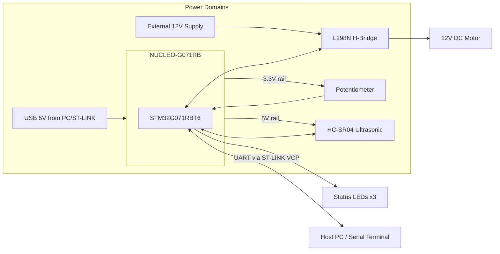

# Hardware Design Documentation

## 1. Block Diagram

## 2. Component Rationale

### 2.1 STM32 NUCLEO-G071RB

- Cortex-M0+ @ up to 64 MHz — more than sufficient for a 50 ms control loop with headroom for
  ultrasonic timing capture and UART.
- Onboard ST-LINK/V2-1 provides programming, SWD debug, and a USB virtual COM port in one cable —
  no external programmer or USB-serial adapter required.
- 128 KB flash / 36 KB RAM comfortably fits this application with room for future RTOS/CAN work.
- Rich timer set (TIM1/TIM2/TIM3/TIM14/TIM16/TIM17) allows dedicating one timer to ultrasonic
  input capture and a separate timer to PWM generation without conflicts.

### 2.2 HC-SR04 Ultrasonic Sensor

- Simple 2-pin (Trig/Echo) digital interface, 5V logic tolerant on the NUCLEO's 5V-tolerant GPIO
  pins (verify per datasheet pin; PA0 on G0 is 5V tolerant on many packages — confirm against the
  specific Nucleo variant's datasheet before connecting).
- Effective range ~2 cm – 400 cm, accuracy ~3 mm, sufficient for a benchtop demo scale.
- Echo pulse width is measured via hardware timer input capture (TIM2 CH1) rather than software
  polling, minimizing CPU load and jitter.

### 2.3 L298N Dual H-Bridge Driver

- Simple, ubiquitous, breadboard-friendly motor driver capable of driving a 12V DC motor at
  currents well beyond what a single GPIO/PWM pin can source.
- PWM applied to `ENA` sets speed; `IN1`/`IN2` digital logic sets direction (forward/brake/coast).
- Onboard 5V regulator can optionally power logic-side circuitry, but in this design the NUCLEO's
  own 5V rail powers the HC-SR04 to keep power domains simple; the L298N's 12V input is dedicated
  to the motor supply.

### 2.4 12V DC Motor

- Acts as the "vehicle speed" analog. Open-loop PWM control is used (no encoder feedback in the
  base design); see `docs/ALGORITHM.md` Future Work for closed-loop upgrade path.

### 2.5 Potentiometer

- Provides an intuitive, physical "desired cruise speed" input, read via ADC1 on PA4.
- 10 kΩ linear taper recommended to keep loading on the 3.3V reference negligible.

### 2.6 Status LEDs

- Three LEDs (Green/Yellow/Red) map directly to FSM zones for at-a-glance system state without
  needing a serial terminal open — useful for live demos.

## 3. Electrical Notes

- **Do not power the L298N's 12V motor rail from the NUCLEO's 5V or 3.3V regulators.** Use a
  dedicated 12V supply (bench supply or battery pack) rated for at least the motor's stall
  current.
- **Common ground is mandatory.** The NUCLEO GND, HC-SR04 GND, L298N GND (both logic and power
  sides), and the 12V supply GND must all be tied together, or PWM/direction signals will float
  and behave unpredictably.
- **Flyback/inrush:** the L298N's onboard flyback diodes handle motor inductive kickback; no
  additional snubber is required for the recommended small 12V brushed DC motor.
- **HC-SR04 5V logic:** confirm the exact GPIO pins used (PA0/PA1 in this design) are 5V-tolerant
  on your specific NUCLEO-G071RB silicon revision before wiring directly; if in doubt, use a
  simple resistor divider or level shifter on the Echo line (5V → 3.3V) for safety margin, even
  though many G0 GPIOs are FT (5V tolerant).

## 4. Mechanical/Layout Notes

- Keep ultrasonic sensor wiring short and away from the PWM/motor wiring to minimize electrical
  noise coupling into the echo-timing measurement (PWM switching edges are a common noise source
  for ultrasonic ranging).
- Mount the HC-SR04 facing directly forward along the direction of "vehicle" travel, at a height
  clear of the chassis/breadboard to avoid false near-field reflections.

## 5. Full Pin and Power Detail

See [`hardware/PIN_CONNECTIONS.md`](../hardware/PIN_CONNECTIONS.md) and
[`hardware/POWER_REQUIREMENTS.md`](../hardware/POWER_REQUIREMENTS.md) for the complete signal
table and power budget.
