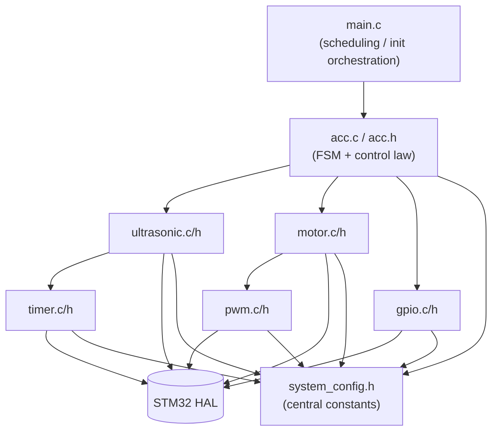

# Software Architecture Documentation

## 1. Design Philosophy

The firmware follows a **layered, HAL-abstracted architecture** with a strict dependency
direction: application logic (`acc.c`) depends on driver modules (`ultrasonic.c`, `motor.c`,
`pwm.c`, `gpio.c`, `timer.c`), which depend on the STM32 HAL, which depends on CMSIS. No layer
depends "upward." This makes each module independently testable and the application logic
hardware-agnostic beyond the driver API contracts.

## 2. Module Responsibilities

| Module | Responsibility | Depends on |
|---|---|---|
| `system_config.h` | Central location for every pin assignment, timing constant, and distance threshold. No `.c` file — header-only constants/macros. | — |
| `gpio.h/.c` | Initializes and drives discrete GPIO: status LEDs, L298N `IN1`/`IN2` direction pins, HC-SR04 trigger pin. | HAL GPIO |
| `timer.h/.c` | Configures `TIM2` for microsecond-resolution input capture (ultrasonic echo timing) and the base tick used for the 50 ms control loop scheduling. | HAL TIM |
| `pwm.h/.c` | Configures `TIM3 CH1` as a PWM output for motor speed (`ENA` on the L298N) and exposes a simple `PWM_SetDutyCycle(percent)` API. | HAL TIM |
| `ultrasonic.h/.c` | Drives the HC-SR04: issues the trigger pulse, captures echo pulse width via `timer.c`'s input-capture callback, converts time-of-flight to millimeters, and detects timeout/implausible readings. | `timer.h`, HAL GPIO/TIM |
| `motor.h/.c` | Translates a desired duty-cycle percentage and direction into `pwm.c` and `gpio.c` calls; owns the "motor off" fail-safe primitive used by fault handling. | `pwm.h`, `gpio.h` |
| `acc.h/.c` | The application core: the FSM, the proportional adaptive speed law, hysteresis logic, ADC-based setpoint reading, and UART telemetry frame construction. | `ultrasonic.h`, `motor.h`, `gpio.h`, HAL ADC/UART |
| `main.c` | HAL/clock/peripheral init (via CubeMX-generated calls), then hands off to the fixed-period main loop that calls `ACC_Update()` every control cycle. | Everything above |

## 3. Execution Model

- **No RTOS.** A super-loop architecture is used, gated to a fixed 50 ms period using
  `HAL_GetTick()` (SysTick-driven). This keeps the reference implementation approachable while
  still being fully deterministic for a control loop of this simplicity.
- **Interrupt-driven ultrasonic timing.** The HC-SR04 echo pulse width is measured using `TIM2`
  input-capture interrupts (rising edge starts the capture, falling edge stops it and computes
  pulse width), rather than blocking on `HAL_Delay`/GPIO polling. This is critical: a polling
  approach would either block the control loop or introduce large timing jitter.
  See `docs/ALGORITHM.md §5` for the interrupt sequence.
- **UART is non-blocking-friendly.** Telemetry frames are transmitted using `HAL_UART_Transmit`
  in blocking mode with a short timeout, acceptable at 115200 baud for the short frame length and
  50 ms period (transmission time is on the order of 1–2 ms, well under budget). A future upgrade
  path to `HAL_UART_Transmit_IT`/DMA is noted in Future Work.

## 4. Build Instructions

1. Install **STM32CubeIDE** (1.15.x+) and **STM32CubeMX** (6.11.x+, or use the version bundled
   with CubeIDE).
2. Open `firmware/STM32CubeMX/Project.ioc` in CubeMX, confirm the pin assignments match
   `hardware/PIN_CONNECTIONS.md`, and click **Generate Code** targeting the `firmware/` folder.
   This regenerates `firmware/Drivers/` (CMSIS + STM32G0xx HAL) and the peripheral init stubs
   inside `Core/Src/*.c` (`MX_GPIO_Init`, `MX_TIM2_Init`, etc. — already called from `main.c` in
   this repository's `main.c`).
3. In STM32CubeIDE: `File → Open Projects from File System...` → select `firmware/`.
4. `Project → Build Project` (or `Ctrl+B`).
5. Connect the NUCLEO-G071RB via USB, then `Run → Debug` or `Run → Run` to flash.

## 5. Code Style Conventions

- **Naming:** `PascalCase` for public functions prefixed by module (`Ultrasonic_GetDistanceMM`),
  `snake_case` for local variables, `ALL_CAPS` for macros/constants.
- **Header guards:** `#ifndef MODULE_H` / `#define MODULE_H` / `#endif /* MODULE_H */`.
- **No magic numbers in logic files** — all thresholds and pin references pull from
  `system_config.h`.
- **Every public function is documented** with a Doxygen-style comment block (`@brief`,
  `@param`, `@retval`).
- **Return codes:** driver functions return an `HAL_StatusTypeDef`-compatible status or a
  module-specific status enum (e.g., `US_Status_t`) rather than silently failing.

## 6. Central Configuration (`system_config.h`)

All of the following are defined in one place so the whole system can be retuned or ported
without touching logic files:

- Pin/port assignments for every signal
- Timer/peripheral handle names and clock assumptions
- Control loop period (`CONTROL_LOOP_PERIOD_MS`)
- Distance zone thresholds and hysteresis band
- PWM frequency and duty-cycle limits
- UART baud rate
- ADC reference/resolution assumptions

## 7. Debugging Tips

- If telemetry shows `dist=999` repeatedly, the ultrasonic driver has flagged a timeout — check
  wiring/power to the HC-SR04 first (see `hardware/PIN_CONNECTIONS.md`).
- If the motor never moves, verify the L298N has its 12V supply connected and enabled — the PWM
  and direction lines from the MCU are logic-level only and do not power the motor.
- Use the SWD debugger with a breakpoint in `ACC_Update()` to step through FSM transitions live.
