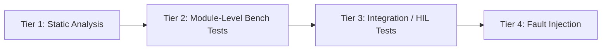

# Testing and Verification Plan

## 1. Testing Strategy

Testing is organized into four tiers, from cheapest/fastest to most representative of real
operating conditions:



| Tier | Description | Tools |
|---|---|---|
| 1 | Static analysis / build warnings | `-Wall -Wextra` in CubeIDE, optional MISRA-C checker |
| 2 | Individual driver verification on the bench | Multimeter, oscilloscope/logic analyzer, serial terminal |
| 3 | Full system integration (Hardware-in-the-Loop) | Physical rig with obstacle on a slide/track |
| 4 | Deliberate fault injection | Disconnecting sensor, blocking echo path, extreme distances |

## 2. Tier 1 — Static Analysis

- Build with `-Wall -Wextra -Wpedantic` and confirm **zero warnings** (NFR-5 in
  `PROJECT_OVERVIEW.md`).
- Confirm no dynamic allocation (`grep -R "malloc\|calloc\|free(" firmware/Core/Src` should
  return nothing).
- Confirm every public function in each header has a matching Doxygen comment block in the
  corresponding `.c` file.

## 3. Tier 2 — Module-Level Bench Tests

### 3.1 GPIO / LED test

| Test ID | Procedure | Expected Result |
|---|---|---|
| GPIO-01 | Call `GPIO_SetStatusLED(LED_GREEN, GPIO_PIN_SET)` from a debug breakpoint | Green LED illuminates |
| GPIO-02 | Cycle through all three LED states | Each LED independently controllable, no cross-talk |

### 3.2 Timer / Ultrasonic driver test

| Test ID | Procedure | Expected Result |
|---|---|---|
| US-01 | Place a flat object at a measured 30 cm from the sensor; read `Ultrasonic_GetDistanceMM()` over UART | Reported distance within ±5 mm of 300 mm |
| US-02 | Remove all obstacles (open air, > 4 m) | Driver reports `US_STATUS_TIMEOUT` after `US_ECHO_TIMEOUT_MS` |
| US-03 | Sweep an object from 5 cm to 200 cm in 10 cm steps, log each reading | Monotonic distance readings tracking actual position within tolerance |
| US-04 | Disconnect the Echo line | Driver reports `US_STATUS_TIMEOUT` consistently, never a stale/garbage value |

### 3.3 PWM / Motor driver test

| Test ID | Procedure | Expected Result |
|---|---|---|
| PWM-01 | Call `PWM_SetDutyCycle(0)`, `(50)`, `(100)` in sequence, observe on oscilloscope at `ENA` | Duty cycle matches commanded value ±1% |
| MOT-01 | Call `Motor_SetSpeed(50, MOTOR_DIR_FORWARD)` | Motor spins forward at a moderate rate, `IN1`=1/`IN2`=0 |
| MOT-02 | Call `Motor_SetSpeed(50, MOTOR_DIR_REVERSE)` | Motor spins reverse, `IN1`=0/`IN2`=1 |
| MOT-03 | Call `Motor_EmergencyOff()` | Motor stops within one PWM period, `IN1`=`IN2`=1 (active brake) |

### 3.4 ADC / Potentiometer test

| Test ID | Procedure | Expected Result |
|---|---|---|
| ADC-01 | Sweep potentiometer from 0% to 100% while reading `ACC_GetSetpointPercent()` over UART | Reported setpoint tracks pot position monotonically, 0–100% |

## 4. Tier 3 — Integration / HIL Tests

Set up a straight track (e.g., a meter ruler or tape-measured floor line) with the ultrasonic
sensor fixed at one end and a flat obstacle (e.g., a book/board) that can be manually slid along
the track.

| Test ID | Procedure | Expected Result |
|---|---|---|
| INT-01 | Set potentiometer to ~65%, obstacle at > 40 cm | FSM = `CRUISE`, motor duty ≈ 65%, Green LED on |
| INT-02 | Slide obstacle to 35 cm | FSM = `SLOW_DOWN`, duty reduces proportionally, Yellow LED on |
| INT-03 | Slide obstacle to 20 cm | FSM = `BRAKE`, duty ≤ `ACC_BRAKE_MAX_DUTY_PCT`, Red LED blinking |
| INT-04 | Slide obstacle to 8 cm | FSM = `EMERGENCY_STOP`, duty = 0%, Red LED solid |
| INT-05 | Slide obstacle back beyond 40 cm and hold | FSM transitions `EMERGENCY_STOP → RECOVER → CRUISE` after `ACC_RECOVER_CYCLES`, no chatter |
| INT-06 | Hold obstacle stationary exactly at the `WARN_DIST_MM` boundary | FSM does not oscillate between `CRUISE`/`SLOW_DOWN` (hysteresis holds) |

## 5. Tier 4 — Fault Injection Tests

| Test ID | Procedure | Expected Result |
|---|---|---|
| FLT-01 | Disconnect HC-SR04 Echo wire mid-run | FSM → `FAULT` within one control cycle after timeout, motor forced off, all LEDs blinking |
| FLT-02 | Disconnect HC-SR04 power | Same as FLT-01 |
| FLT-03 | Reconnect sensor after a `FAULT` | System re-enters `INIT`, passes self-test, returns to `CRUISE` |
| FLT-04 | Physically obstruct the sensor face at < 2 cm (below `US_MIN_VALID_MM`) | Reading rejected as implausible, `FAULT` entered rather than trusting a garbage near-zero value |
| FLT-05 | Disconnect motor driver 12V supply while running | Firmware behavior unaffected (MCU logic still runs); confirms MCU-side logic does not depend on motor rail health — documents a real limitation (no current-sense fault detection) |

## 6. UART Telemetry Capture (for logging/plotting)

Use the optional Python tooling described in `requirements.txt`:

```bash
pip install -r requirements.txt
python3 -m serial.tools.list_ports         # identify the NUCLEO virtual COM port
```

A minimal capture script (not included as a maintained artifact in this repo, but straightforward
to write with `pyserial`) can open the COM port at 115200 baud, read newline-terminated telemetry
frames, and log them to CSV for `matplotlib`/`pandas` analysis, e.g. plotting `distance_mm` vs
`duty_pct` vs time to visually verify the proportional control law described in
`docs/ALGORITHM.md §3`.

## 7. Acceptance Criteria Summary

The system is considered to meet its verification goals when:

- All Tier 1 static checks pass with zero warnings.
- All Tier 2 module tests pass within stated tolerances.
- All Tier 3 integration tests show correct FSM transitions with no chatter (INT-06).
- All Tier 4 fault injection tests result in a safe (motor-off) state, never an unsafe
  (motor-on-with-bad-data) state.
