# Power Requirements and Budget

## 1. Power Domains

```mermaid
flowchart TB
    USB["USB 5V (from PC/ST-LINK)"] --> NUCLEO_5V["NUCLEO 5V rail"]
    NUCLEO_5V --> MCU3V3["Onboard 3.3V regulator (NUCLEO-G071RB)"]
    MCU3V3 --> STM32["STM32G071RBT6"]
    MCU3V3 --> Pot["Potentiometer"]
    NUCLEO_5V --> HCSR04["HC-SR04 (5V logic)"]

    EXT12["External 12V Supply (>= 2A)"] --> L298N["L298N Motor Driver"]
    L298N --> Motor["12V DC Motor"]

    STM32 -.control signals only, no power.-> L298N
```

**Critical rule:** the 12V motor rail is electrically separate from the NUCLEO's USB-derived
5V/3.3V rails. Only *signal* lines (PWM, IN1, IN2) cross between the MCU and the L298N — no
power. The two supplies share a common ground reference only.

## 2. Current Budget

| Load | Typical Current | Peak Current | Supplied From |
|---|---|---|---|
| STM32G071RBT6 core (64 MHz, peripherals active) | ~15 mA | ~25 mA | USB 5V → onboard 3.3V regulator |
| HC-SR04 | ~15 mA (active), ~2 mA (idle) | ~20 mA | NUCLEO 5V rail |
| Potentiometer (10 kΩ) | ~0.33 mA (@3.3V) | negligible | NUCLEO 3.3V rail |
| Status LEDs (x3, 330Ω, worst case all on) | ~3 × 7 mA = 21 mA | ~21 mA | NUCLEO 3.3V rail via GPIO |
| L298N logic supply (internal) | ~36 mA (both channels active) | ~50 mA | Derived internally from 12V input (or 5V, not used here) |
| L298N motor channel (per the connected 12V DC motor) | Motor-dependent, e.g. 300–800 mA typical hobby gear motor | Up to motor stall current (verify against your motor's datasheet, typically 1–2A) | External 12V supply |

## 3. USB Port Budget (NUCLEO side)

Total NUCLEO-side draw (MCU + HC-SR04 + LEDs + pot) is well under 100 mA, comfortably within a
standard USB 2.0 port's 500 mA budget, leaving headroom for the ST-LINK's own consumption.

## 4. External 12V Supply Sizing

Size the external 12V supply for **at least the motor's stall current**, not just its running
current, since the L298N will briefly see stall-current draw during start/stop transients
(including the Emergency-Stop active-brake condition). A 12V/2A regulated bench supply or a
12V/2200mAh+ battery pack is a safe default for a small hobby gear motor.

## 5. Grounding

All of the following grounds must be tied together at a single common point to avoid floating
references and erratic PWM/direction behavior:

- NUCLEO GND (any GND pin on CN6/CN7/CN10)
- HC-SR04 GND
- L298N logic GND
- L298N power GND
- External 12V supply negative terminal

## 6. Protection Recommendations

- Add a fuse (e.g., 2A fast-blow) in series with the external 12V supply's positive lead as cheap
  insurance against a wiring mistake or motor stall condition.
- If driving a larger motor than the reference 12V hobby motor, re-verify the L298N's per-channel
  current rating (2A) is not exceeded — upgrade to a MOSFET-based driver (e.g., a BTS7960 module)
  for higher-current motors.
